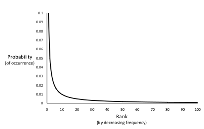
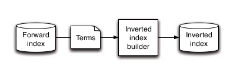
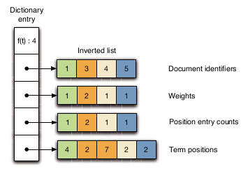
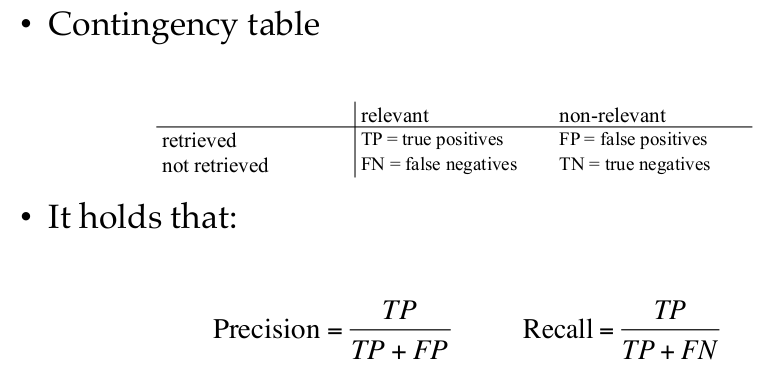
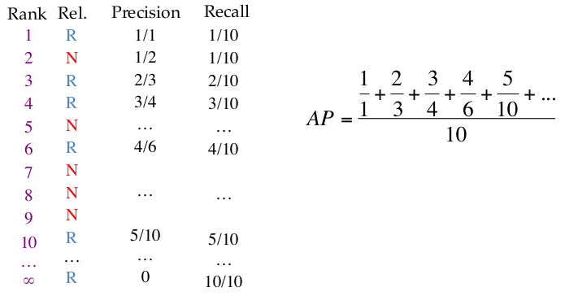
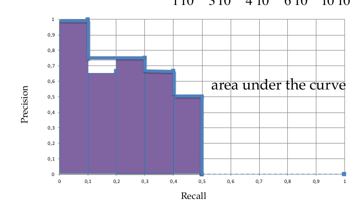
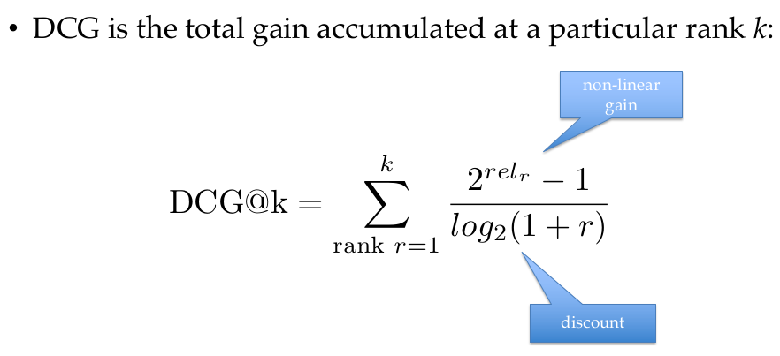
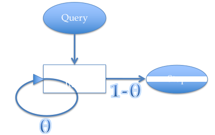
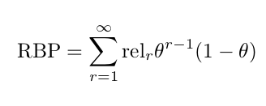

# Summary IR1 UvA, 2019-2020
- [Summary IR1 UvA, 2019-2020](#summary-ir1-uva-2019-2020)
  - [Lecture 1 & 2](#lecture-1--2)
    - [Introduction](#introduction)
    - [Crawling](#crawling)
    - [Text Analysis](#text-analysis)
    - [Link Analysis](#link-analysis)
      - [Link analysis](#link-analysis-1)
      - [PageRank](#pagerank)
    - [Indexing](#indexing)
      - [Data Structures](#data-structures)
      - [Inverted Index](#inverted-index)
      - [Constructing an Index](#constructing-an-index)
      - [Updating an Index](#updating-an-index)
  - [Lecture 3 Offline Evaluation](#lecture-3-offline-evaluation)
    - [Evaluation Measures](#evaluation-measures)
      - [Relevance as a Binary Classifier](#relevance-as-a-binary-classifier)
      - [Relevance as a non-Binary Classifier](#relevance-as-a-non-binary-classifier)
        - [(N)DCG:](#ndcg)
        - [Model-based measure: browsing/positions-based models, RPB](#model-based-measure-browsingpositions-based-models-rpb)
        - [Model-based measure: document utility](#model-based-measure-document-utility)
        - [Model-based measure: utility accumulation model](#model-based-measure-utility-accumulation-model)
    - [Comparisons](#comparisons)
    - [Collection Construction](#collection-construction)
  - [Lecture 4](#lecture-4)
  - [Lecture 5](#lecture-5)
  - [Lecture 6](#lecture-6)
  - [Lecture 7](#lecture-7)
  - [Lecture 8](#lecture-8)
  - [Lecture 9](#lecture-9)
  - [Lecture 10](#lecture-10)
  - [Lecture 11](#lecture-11)
  - [Lecture 12](#lecture-12)

## Lecture 1 & 2

### Introduction

Information Retrieval is technology that *connects* **_people_** to **information**. We have __two__ phases:Offline and Online. In this course, the following will be discussed: 

- Offline
  - Term-based Scoring
  - Semantic Scoring
  - Learning to Rank
  - Offline Evaluation
  - Hypothesis Testing
- Online
  - Counterfactual LTR
  - Interactions
  - Counterfactual Evaluation
  - Online Evaluation

Different **scenarios** include:

- Search and Retrieval
- Conversation Search
- Entity Search
- Recommender Systems

**Subject** of this lecture:

### Crawling
Crawling has two main topic and and some additional topics:

1. *Crawling*
   1. Politeness: How to be polite?
      1. Identify: fill in `user-agent` field in the HTTP request and include the word "crawler", "robot", etc.
      2. Obey Exclusion Protocols: certain pages have exlusio rules
      3. Keep a low bandwidth usage in a given site: crawls delays, emperical thresholds.
   2. Extending the Web Repository:
      1. Strategies to find pages: Random ordering, Bread-first
      2. Prioritization Strategies: Conectivity of pages, Importance of pages
   3. Refreshing the Web Repository:
      1. Age: time passed since last download of a page
      2. Longevity: estimated update frequency of page
      3. **Actual Implementation**: maintaining three queues:
         1. Queue for new sites.
         2. Queue for popular/relevant sites
         3. Queue for the rest of the web
2. *Practical Considerations*
   1. Storage and data structures
   2. Distributed crawling
      1. Firewall mode: crawlers only check own pages
      2. Cross-over mode: Duplicating pages to other crawlers if it's around your border
      3. Exachange mode: crawlers share non-local links and send URLs in small batches
3. *Additional Topics*
   1. Duplicate detection.
      1. Problems: Mirroring, Different URLs &rarr; same content, URL modifiers
      2. Solutions: Hashing by computing complete hash value of document (and then comparing hash values of docs). Or Shinling (near duplicate detection).
   2. Spam
      1. Types: Cloacking (redirection spam), link, content, click. (May want to add further explenation/ solution)

### Text Analysis

1. *Statistical properties of written text*
   1. Zipf's law: how a term is distributed across documents where, on avarage, the first most common word occurs twice as often as the second most common, the second twice as often as the third, etc. 
   2. Heaps' law: an estimate of the vocabulary size as a function of the collection size: $vocab = const * words^\beta$. It is a simple relationship between collection size and vocab size.
2. *Text Analysis Pipeline*
   1. Remove white-space and punctuation
   2. Convert terms to lower-case
   3. Remove stop-words: frequency- or dictionary-based
   4. Convert terms to their stems
   5. Deal with phrases
   6. Apply language-specific processing rules
3. *Stemming*
   1. Algorithmic 
   2. dictionary-based
   3. hybrid
4. *Phrases*
   1. Noun-phrases: sequence of nouns/ adjective followed by nouns
   2. Detecing phrases at query processing time
   3. Use frequent n-grams
5. *Spell Checking*
   1. Simple typos: 
      1. Insertion Error
      2. Deletion Error
      3. Substitution Error
      4. Transpoosition Error
   2. Homophones: words with the same sound but different meaning
   3. Multiple corrections
   4. Considering context

### Link Analysis

#### Link analysis

Link analysis can be done on multiple levels:
  
- Macroscopic: structure of the Web at large
- Mesoscopic: properies of areas/regions of the Web
- Microscopic: statistical properties of links and nodes

Needs possible further explenations
#### PageRank

Checks the qulaity of a page, independent of queries. It's a stationary state of a random walk with teleportation through the pages: we go through a page and follow links, if we're at a dead end, we teleport to a random page, or at each step with a probability.

The more a page is visited, the better the page.The long-term visit rate = PageRank.

Something about **Ergodic Markov Chains**.

Important take-aways: query-independent and precomputed.

### Indexing

The following informaton is specific for WebSearch. How do we store links?

#### Data Structures

Four different structures:

1. Inverted index (see: [Inverted Index](#inverted-index))
2. Web graph: the links are stored seperately
3. Forward Index: index from documents to words
4. Page Attribute File: meta information of document (click-through rate, length, PageRank, etc.)

#### Inverted Index

**Intuition**: it's like the index of a book: you have a word with the page number it's on. For a webpage: words with links to document ID's.

It's made up of two structures:

1. Dictionary, each entry contains:
   1. Number of pages containing the term
   2. Point to the start of the inverted lists
   3. Other meta-data about the term
2. Inverted Lists: this is like the index of the book, where we can store things like:
   - document number
   - per document how often the word occurs in it
   - document and the positions of the word
   - Weights (TF-IDF, etc.)

Summarised in a picture:

What we shouldn't store in here: things that are independent of a single word.

- PageRank
- Document Length

#### Constructing an Index

There are simple inexers, they have problems though:

1. In-memory: if the indexes become to large it doesn't fit into memory. There exits two approaches to fix this:
   1. Two-pass index: first pass is collecting statistics, then fill in the inverted index.
   2. One-pass index: when you are out of memory, you off-load it to the disk, rinse and repeat. When you are done, you stick your off-loaded materials together.
2. Single-threaded: you can do MapReduce (distributed indexing)

#### Updating an Index

When we get new information for our webpages or other information, we have to update our indexes. There are several solutions.

1. No Merge
   1. Method: We keep on creating new delta indeces
   2. Pros: low index maintenance cost
   3. Cons: query all new indeces and somehow merge results &rarr; high processing costs.
2. Incremental update
   1. Method: keep on adding things to old index
   2. Pros: no read/write of entire index when updating
   3. Cons: evantually memory for index will run out and will become very slow.
3. Immediate merge (in-memory)
   1. Method: you have a delta index and old index, sometimes you merge the two.
   2. Pros: only one single index
   3. Cons: You use the same index for merging and querying (problems when users want to use your system)
4. Lazy merge
   1. Method: hybrid, merging in the background (new into old). 
5. Page deletions: what to do when a page is deleted and we have to remove it from the index?
   1. Method: keep a lists of deleted documents, then we go over the the entire list and delete the from the collection (garbage collection).

## Lecture 3 Offline Evaluation

How do we measure/ quantify how good a retrieval system is? Old techniques relied on the **HiPPO-technique: Highest Paid Person's Opinion**. Improvements have been made since.

We can do user-studies (not coverted), off- and online evaluation. This lecture talks about offline evaluation.

Offline evaluation we proxy a user and ask if the algorithm brought up more relant results than another. The two element we have to test a system:

1. User Queries
2. Retrieved Documents

and then labels of relevance for each document.

Offline evaluation is made up of three parts: [evaluation measures](#evaluation-measures), [comparisons](#comparisons), [collection construction](#collection-construction).

### Evaluation Measures

There are about 200+ measures, therefor we have to carefully choose which measure to use. 

First, we have to define what a "*relevant*" document is. This can be done in multiple ways and we have to assume the following things about relevance:

1. **Topical**: if both a query and document are about the same topic.
2. **Binary**: relevant vs. non-relevant
3. **Independent**: relevant of documet A does not depend on document B
4. **Stable**: judgements change over time and are never stable
5. **Consistent**: the relevance labels are consitent across different judges
6. **Complete**: we have the labels for every document in a collection

#### Relevance as a Binary Classifier

The two metric then are *precision* and *recall*:

When we have a ranked list, how do we turn it into a binary classification problem?

Answer: we look at the *top-k* documents, and see which of the retrieved documents are relevant. We do this for Precision and Recall: Precision/Recall @ k (**P/R@k**). 

A **high precision** means:

- user looks at top results
- repository is large, with easy to find relevant pages
- imperfect recall is OK

A **high recall** means:

- users are not satisfied with only top-k documents. Think about patents, legal or medical searches.  

However, these are *set*-metrics, so they don't suit our purposes. We need to use them to a metric that is usefull for a retrieval system.

**Average Precision (AP)** is such a metric and calculated in the following way:

AP is the area-under-the-curve of the Precision/Recall Graph:

It gives you a score for a ranking and not just for your binary classification. You always devide by your total number of relevant documents.

#### Relevance as a non-Binary Classifier

##### (N)DCG: 

We can have more relevance labels other than just two (Bing for example has 7). Precision and Recall cannot handle this. A metric that *can* handle this is **Discounted Cumulative Gain (DCG)**.

Intuition behind DCG: when you find a document, how much *utility* does it give and how much effort does it take to find this relevant document? 

The forumla:

Non-linear gain: the utility/usefullnes function. This function is exponential because when your document is relevant and at the top, it has alot more effect on the score.

Dicount: the effort to find the document

We need to normalize (range of 0~1) this function because we can then average over queries that have different numbers of relevant documents. We get **NDCG**. You normalize with: optimal DCG, aka the DCG of the documents were ranked optimally by their non-binary rank.

##### Model-based measure: browsing/positions-based models, RPB

Described how users interact with results.

It depends on the position of the document if the users goes to the next one. So the higher a document is, the more chance it has to be viewed. We get a metric called **Rank Biased Precision (RPB)** and is the expected utility at stopping at rank k.

The model:

The metric:

Where $\theta=P(continuing)$. It expresses the probability of *reaching* rank k and *stopping* at rank k.

##### Model-based measure: document utility

##### Model-based measure: utility accumulation model

### Comparisons

### Collection Construction

## Lecture 4

## Lecture 5

## Lecture 6

## Lecture 7

## Lecture 8

## Lecture 9

## Lecture 10

## Lecture 11

## Lecture 12