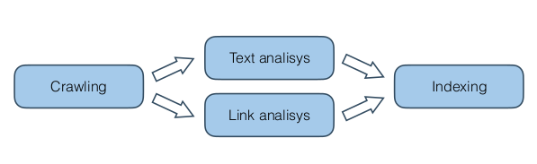

# Summary IR1 UvA, 2019-2020
- [Summary IR1 UvA, 2019-2020](#summary-ir1-uva-2019-2020)
  - [Lecture 1](#lecture-1)
    - [Introduction](#introduction)
    - [Crawling](#crawling)
    - [Text Analysis](#text-analysis)
    - [Link Analysis](#link-analysis)
    - [Indexing](#indexing)
  - [Lecture 2](#lecture-2)
  - [Lecture 3](#lecture-3)
  - [Lecture 4](#lecture-4)
  - [Lecture 5](#lecture-5)
  - [Lecture 6](#lecture-6)
  - [Lecture 7](#lecture-7)
  - [Lecture 8](#lecture-8)
  - [Lecture 9](#lecture-9)
  - [Lecture 10](#lecture-10)
  - [Lecture 11](#lecture-11)
  - [Lecture 12](#lecture-12)

## Lecture 1

### Introduction

Information Retrieval is technology that *connects* **_people_** to **information**. We have __two__ phases:Offline and Online. In this course, the following will be discussed: 

- Offline
  - Term-based Scoring
  - Semantic Scoring
  - Learning to Rank
  - Offline Evaluation
  - Hypothesis Testing
- Online
  - Counterfactual LTR
  - Interactions
  - Counterfactual Evaluation
  - Online Evaluation

Different **scenarios** include:

- Search and Retrieval
- Conversation Search
- Entity Search
- Recommender Systems

Subject of this lecture:

### Crawling

### Text Analysis

### Link Analysis

### Indexing

## Lecture 2

## Lecture 3

## Lecture 4

## Lecture 5

## Lecture 6

## Lecture 7

## Lecture 8

## Lecture 9

## Lecture 10

## Lecture 11

## Lecture 12