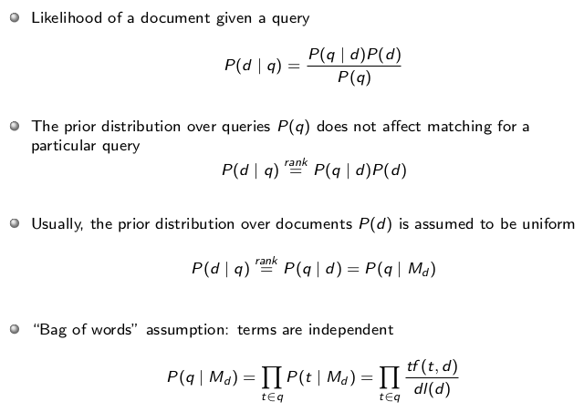
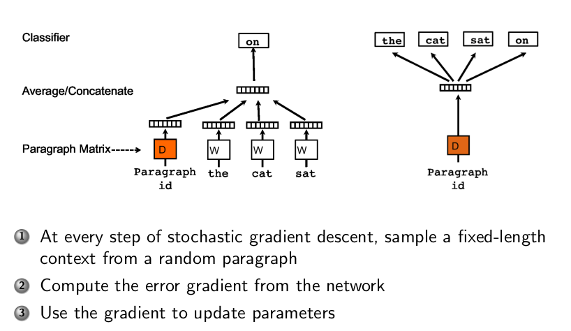

# Summary IR1 UvA, 2019-2020
- [Summary IR1 UvA, 2019-2020](#summary-ir1-uva-2019-2020)
  - [Week 1: Lecture 1 & 2](#week-1-lecture-1--2)
    - [Introduction](#introduction)
    - [Crawling](#crawling)
    - [Text Analysis](#text-analysis)
    - [Link Analysis](#link-analysis)
      - [Link analysis](#link-analysis-1)
      - [PageRank](#pagerank)
    - [Indexing](#indexing)
      - [Data Structures](#data-structures)
      - [Inverted Index](#inverted-index)
      - [Constructing an Index](#constructing-an-index)
      - [Updating an Index](#updating-an-index)
  - [Week 2: Lecture 3, Offline Evaluation](#week-2-lecture-3-offline-evaluation)
    - [Evaluation Measures](#evaluation-measures)
      - [Relevance as a Binary Classifier](#relevance-as-a-binary-classifier)
      - [Relevance as a non-Binary Classifier](#relevance-as-a-non-binary-classifier)
        - [(N)DCG:](#ndcg)
        - [Model-based measure: browsing/positions-based models, RPB](#model-based-measure-browsingpositions-based-models-rpb)
        - [Model-based measure: document utility, Cascade Model, Expected Effort](#model-based-measure-document-utility-cascade-model-expected-effort)
        - [Novelty-based measures](#novelty-based-measures)
        - [Issues with previous measures, Session measures](#issues-with-previous-measures-session-measures)
  - [Week 2: Lecture 4, Meta-Evaluation](#week-2-lecture-4-meta-evaluation)
    - [Comparing Metrics](#comparing-metrics)
      - [Maximum Entropy Method](#maximum-entropy-method)
    - [Collection Construction](#collection-construction)
  - [Week 2, Lecture 4: Query Processing](#week-2-lecture-4-query-processing)
    - [Query Analysis](#query-analysis)
    - [Query Processing/ Ranking](#query-processing-ranking)
      - [First-Phase Query Processing /  Simple Ranking](#first-phase-query-processing--simple-ranking)
      - [Simple Ranking: Term based Vector Space Model](#simple-ranking-term-based-vector-space-model)
      - [Simple Ranking: Term based Language Modeling](#simple-ranking-term-based-language-modeling)
      - [Simple Ranking: Term based BM25](#simple-ranking-term-based-bm25)
  - [Week 3: Lecture 5, Semantic Based Retrieval](#week-3-lecture-5-semantic-based-retrieval)
    - [Simple Ranking: Topic based Modeling](#simple-ranking-topic-based-modeling)
    - [Simple Ranking: Latent Semantic Indexing/ Analysis, Vector models](#simple-ranking-latent-semantic-indexing-analysis-vector-models)
    - [Intermezzo: which technique works better](#intermezzo-which-technique-works-better)
    - [Simple Ranking: Nerual Models](#simple-ranking-nerual-models)
      - [Word Embeddings](#word-embeddings)
      - [Document Embeddings](#document-embeddings)
  - [Week 3: Lecture 6, Offline Learning to Rank](#week-3-lecture-6-offline-learning-to-rank)
  - [Week 4: Lecture 7](#week-4-lecture-7)
  - [Week 4: Lecture 8](#week-4-lecture-8)
  - [Week 5: Lecture 9](#week-5-lecture-9)
  - [Week 5: Lecture 10](#week-5-lecture-10)
  - [Week 6: Lecture 11](#week-6-lecture-11)
  - [Week 6: Lecture 12](#week-6-lecture-12)

## Week 1: Lecture 1 & 2

### Introduction

Information Retrieval is technology that *connects* **_people_** to **information**. We have __two__ phases:Offline and Online. In this course, the following will be discussed: 

- Offline
  - Term-based Scoring
  - Semantic Scoring
  - Learning to Rank
  - Offline Evaluation
  - Hypothesis Testing
- Online
  - Counterfactual LTR
  - Interactions
  - Counterfactual Evaluation
  - Online Evaluation

Different **scenarios** include:

- Search and Retrieval
- Conversation Search
- Entity Search
- Recommender Systems

**Subject** of this lecture:

### Crawling
Crawling has two main topic and and some additional topics:

1. *Crawling*
   1. Politeness: How to be polite?
      1. Identify: fill in `user-agent` field in the HTTP request and include the word "crawler", "robot", etc.
      2. Obey Exclusion Protocols: certain pages have exlusio rules
      3. Keep a low bandwidth usage in a given site: crawls delays, emperical thresholds.
   2. Extending the Web Repository:
      1. Strategies to find pages: Random ordering, Bread-first
      2. Prioritization Strategies: Conectivity of pages, Importance of pages
   3. Refreshing the Web Repository:
      1. Age: time passed since last download of a page
      2. Longevity: estimated update frequency of page
      3. **Actual Implementation**: maintaining three queues:
         1. Queue for new sites.
         2. Queue for popular/relevant sites
         3. Queue for the rest of the web
2. *Practical Considerations*
   1. Storage and data structures
   2. Distributed crawling
      1. Firewall mode: crawlers only check own pages
      2. Cross-over mode: Duplicating pages to other crawlers if it's around your border
      3. Exachange mode: crawlers share non-local links and send URLs in small batches
3. *Additional Topics*
   1. Duplicate detection.
      1. Problems: Mirroring, Different URLs &rarr; same content, URL modifiers
      2. Solutions: Hashing by computing complete hash value of document (and then comparing hash values of docs). Or Shinling (near duplicate detection).
   2. Spam
      1. Types: Cloacking (redirection spam), link, content, click. (May want to add further explenation/ solution)

### Text Analysis

1. *Statistical properties of written text*
   1. Zipf's law: how a term is distributed across documents where, on avarage, the first most common word occurs twice as often as the second most common, the second twice as often as the third, etc. 
   2. Heaps' law: an estimate of the vocabulary size as a function of the collection size: $vocab = const * words^\beta$. It is a simple relationship between collection size and vocab size.
2. *Text Analysis Pipeline*
   1. Remove white-space and punctuation
   2. Convert terms to lower-case
   3. Remove stop-words: frequency- or dictionary-based
   4. Convert terms to their stems
   5. Deal with phrases
   6. Apply language-specific processing rules
3. *Stemming*
   1. Algorithmic 
   2. dictionary-based
   3. hybrid
4. *Phrases*
   1. Noun-phrases: sequence of nouns/ adjective followed by nouns
   2. Detecing phrases at query processing time
   3. Use frequent n-grams
5. *Spell Checking*
   1. Simple typos: 
      1. Insertion Error
      2. Deletion Error
      3. Substitution Error
      4. Transpoosition Error
   2. Homophones: words with the same sound but different meaning
   3. Multiple corrections
   4. Considering context

### Link Analysis

#### Link analysis

Link analysis can be done on multiple levels:
  
- Macroscopic: structure of the Web at large
- Mesoscopic: properies of areas/regions of the Web
- Microscopic: statistical properties of links and nodes

Needs possible further explenations
#### PageRank

Checks the qulaity of a page, independent of queries. It's a stationary state of a random walk with teleportation through the pages: we go through a page and follow links, if we're at a dead end, we teleport to a random page, or at each step with a probability.

The more a page is visited, the better the page.The long-term visit rate = PageRank.

Something about **Ergodic Markov Chains**.

Important take-aways: query-independent and precomputed.

### Indexing

The following informaton is specific for WebSearch. How do we store links?

#### Data Structures

Four different structures:

1. Inverted index (see: [Inverted Index](#inverted-index))
2. Web graph: the links are stored seperately
3. Forward Index: index from documents to words
4. Page Attribute File: meta information of document (click-through rate, length, PageRank, etc.)

#### Inverted Index

**Intuition**: it's like the index of a book: you have a word with the page number it's on. For a webpage: words with links to document ID's.

It's made up of two structures:

1. Dictionary, each entry contains:
   1. Number of pages containing the term
   2. Point to the start of the inverted lists
   3. Other meta-data about the term
2. Inverted Lists: this is like the index of the book, where we can store things like:
   - document number
   - per document how often the word occurs in it
   - document and the positions of the word
   - Weights (TF-IDF, etc.)

Summarised in a picture:

What we shouldn't store in here: things that are independent of a single word.

- PageRank
- Document Length

#### Constructing an Index

There are simple inexers, they have problems though:

1. In-memory: if the indexes become to large it doesn't fit into memory. There exits two approaches to fix this:
   1. Two-pass index: first pass is collecting statistics, then fill in the inverted index.
   2. One-pass index: when you are out of memory, you off-load it to the disk, rinse and repeat. When you are done, you stick your off-loaded materials together.
2. Single-threaded: you can do MapReduce (distributed indexing)

#### Updating an Index

When we get new information for our webpages or other information, we have to update our indexes. There are several solutions.

1. No Merge
   1. Method: We keep on creating new delta indeces
   2. Pros: low index maintenance cost
   3. Cons: query all new indeces and somehow merge results &rarr; high processing costs.
2. Incremental update
   1. Method: keep on adding things to old index
   2. Pros: no read/write of entire index when updating
   3. Cons: evantually memory for index will run out and will become very slow.
3. Immediate merge (in-memory)
   1. Method: you have a delta index and old index, sometimes you merge the two.
   2. Pros: only one single index
   3. Cons: You use the same index for merging and querying (problems when users want to use your system)
4. Lazy merge
   1. Method: hybrid, merging in the background (new into old). 
5. Page deletions: what to do when a page is deleted and we have to remove it from the index?
   1. Method: keep a lists of deleted documents, then we go over the the entire list and delete the from the collection (garbage collection).

## Week 2: Lecture 3, Offline Evaluation

How do we measure/ quantify how good a retrieval system is? Old techniques relied on the **HiPPO-technique: Highest Paid Person's Opinion**. Improvements have been made since.

We can do user-studies (not coverted), off- and online evaluation. This lecture talks about offline evaluation.

Offline evaluation we proxy a user and ask if the algorithm brought up more relant results than another. The two element we have to test a system:

1. User Queries
2. Retrieved Documents

and then labels of relevance for each document.

Offline evaluation is made up of three parts: [evaluation measures](#evaluation-measures), [comparisons](#comparisons), [collection construction](#collection-construction).

### Evaluation Measures

There are about 200+ measures, therefor we have to carefully choose which measure to use. 

First, we have to define what a "*relevant*" document is. This can be done in multiple ways and we have to assume the following things about relevance:

1. **Topical**: if both a query and document are about the same topic.
2. **Binary**: relevant vs. non-relevant
3. **Independent**: relevant of documet A does not depend on document B
4. **Stable**: judgements change over time and are never stable
5. **Consistent**: the relevance labels are consitent across different judges
6. **Complete**: we have the labels for every document in a collection

#### Relevance as a Binary Classifier

The two metric then are *precision* and *recall*:

When we have a ranked list, how do we turn it into a binary classification problem?

Answer: we look at the *top-k* documents, and see which of the retrieved documents are relevant. We do this for Precision and Recall: Precision/Recall @ k (**P/R@k**). 

A **high precision** means:

- user looks at top results
- repository is large, with easy to find relevant pages
- imperfect recall is OK

A **high recall** means:

- users are not satisfied with only top-k documents. Think about patents, legal or medical searches.  

However, these are *set*-metrics, so they don't suit our purposes. We need to use them to a metric that is usefull for a retrieval system.

**Average Precision (AP)** is such a metric and calculated in the following way:

AP is the area-under-the-curve of the Precision/Recall Graph:

It gives you a score for a ranking and not just for your binary classification. You always devide by your total number of relevant documents.

#### Relevance as a non-Binary Classifier

##### (N)DCG: 

We can have more relevance labels other than just two (Bing for example has 7). Precision and Recall cannot handle this. A metric that *can* handle this is **Discounted Cumulative Gain (DCG)**.

Intuition behind DCG: when you find a document, how much *utility* does it give and how much effort does it take to find this relevant document? 

The forumla:

Non-linear gain: the utility/usefullnes function. This function is exponential because when your document is relevant and at the top, it has alot more effect on the score.

Dicount: the effort to find the document

We need to normalize (range of 0~1) this function because we can then average over queries that have different numbers of relevant documents. We get **NDCG**. You normalize with: optimal DCG, aka the DCG of the documents were ranked optimally by their non-binary rank.

##### Model-based measure: browsing/positions-based models, RPB

Described how users interact with results, aka it's a *model of the user*.

It depends on the position of the document if the users goes to the next one. So the higher a document is, the more chance it has to be viewed. We get a metric called **Rank Biased Precision (RPB)** and is the expected utility at stopping at rank k.

The model:

The metric:

Where $\theta=P(continuing)$. It expresses the probability of *reaching* rank k and *stopping* at rank k.

**How** do we choose $\theta$ or how is this metric better than NDCG? We can use the logs of our search engine and we can look at the clickthrough rates for every position. We can than choose a $\theta$ such that RBP matches the curve of the clickthrough rate best.

**Why** do we want this, why do we want a user based model? Because we *care* about users and want to align with them.

**What doesn't work** in RBP: it does not capture the relevance of a document on the position. When two documents equally relevant and are in 1st and 2nd place, we still would see a skewed probability to reach the document in the second position. This is not captured by this model.

##### Model-based measure: document utility, Cascade Model, Expected Effort

The cascade model simulates the probability of going to the next document based on the utility of the current document.

The model:

Where $\theta_2,\theta_1,\theta_0$ are the probabilities of moving to the next document when a document is highly, somewhat or not relevant.

The **main difference with RBP**: no moving on only depends on what you have seen so far.

$\theta$ is chosen differently this time and is pre-computed as such:

$\theta_i:=\frac{2^{(1-rel_i)}-1}{2^{\text{max rel}}}$

So the more relevant a document is, the more probability of stopping.

This gives rise to a new metric, **Expected Effort**:

$ERR=\sum_{r=1}^{n}(\underbrace{\prod_{i=1}^{r-1}(1-\theta_i)\theta_i}_{\text{prob of reaching rank r}})\frac{1}{r}$

$\theta$ is in the original paper pre-defined and unlike the **RBP** where we can compute them based on the CTR.

##### Novelty-based measures

There are also click and time model-based measures, which will not go into now.

##### Issues with previous measures, Session measures

All the previously mentioned measures have something called the **redundancy problem**: when we optimize for these measures, we get that the first relevant document contains usefull information but all documents after with the same information are worth less to the user. This is called **redundant information**.

We also have no **diversity** in the search results. A system does not know beforhand the user's intent. When a search result is **diverse** we cater to a space of possible user intents.

A **solution**: we gather different user intents, and then let annotators rank documents for each different intent. Every intent is treated as equal.

we get a new metric **$\alpha$-nDCG**: generalization of nDCG, that accounts for *novelty* and *diveristy*. Where $\alpha$

There is **not a set way** to find intents.

All previous evaluation metric are defined on a **single query**, not a session or search history. However, we do want to optimize for a session. There exists **session based metrics**. In here we don't have query/document pairs but instead topic/collection pairs. You then need a metric that takes everything into account. It gives rise the the **Session DCG**. You have a score for each search in a session, and your final score is the sum of scores.

## Week 2: Lecture 4, Meta-Evaluation

### Comparing Metrics

Meta-Evaluations not discussed:

- based on query logs: 
- side-by-side: predicting choice when results are side-by-side
- discriminitive power: the powerfullness of a test (statistical significance)

How do evaluate objective functions? We focus on the **informativeness** of a metric: the ability to train a system when we use an objective function, aka how **informative** a objective function is to the system.

**Intuition**: tells us how good a metric for a specific problem is.

**Example**: when we have a system that only cares for P@1, and the model improves by putting a document that needs to be at position 1, from position 10 to 5 (good move), the metric P@1 is not informative. Since, both position 10 and 5, for the metric P@1 are equally bad.

#### Maximum Entropy Method

Don't understand quite well, may have to revisit.

**Framework/How** do we find a metric that is more informative? When we have the *value* of a metric, we should be able to tell with more certainty the probability of each document that it is relevant for a given query result. We do this by measuring randomness/**Entropy**, and want to maximaize Entropy under the constraint of our metric value.

### Collection Construction

When we have a problem, sometimes there is no collection (training, validation, test) of queries and relevant results. How do we build these collections?

We need three components:

1. Documents: the type of things we want to retrieve (film, image, webpage, etc.)
2. Queries: collecting queries from users and we can generate topics to put queries under if we have a search problem. If you have a filtering problem, you would have a different type of query.
3. Labels: if you have an extremely large collection, you cannot label each document. You want to have the labeled collection be reusable (= useable when we want to apply other objective functions). To have this guarantee, you need to label everything. There are no theoretical guarantees but only practical guarantees for solutions for this problem: competitions are organized. In these systems are built and create rankings for of documents. These rankings are cutt-off at depth K, and human judges judge each document as (non-)relevant. This is call** depth-K pooling**: . For neural models you also have techniques called **Uniform Random Sampling** and **Stratief Random Sampling**. (Need to rewatch lecture for last two technqiues).

Take-away from **offline evaluation**:

## Week 2, Lecture 4: Query Processing

When we have gotten and cleaned our data, how do we retrieve it? When we get a query, what do we do? We do **query analysis** and **query processing**

### Query Analysis

The pipeline for query analysis/preperation is and should be **the same as the pipeline as you would process you documents**:

- Normalization: lowercasing/tokenization
- Spelling correction
- Segmentation
- Stemming
- Term expansion
- etc.

### Query Processing/ Ranking

We have two phases for big collections (10.000+): First- and Second-phase ranking.

**First-phase** ranking is simple ranking and semantic ranking and is done on the entire collection. We are left with ~10.000 documents.

**Second-phase** ranking is Learning to Rank (Complex Ranking) and this is done on the remaning ~10.000 documents.

If we only have a small collection you do not need two phases.

Overview: 

#### First-Phase Query Processing /  Simple Ranking

Steps:

1. **Matching**: Filtering the documents that contain the words of our query. This can be done by AND/OR operations: we want documents that contain ALL of the words in a query or document or document that at least contain ONE words of the query. **AND operation = Precision**, **OR operation = Recall**.
2. **Simple Ranking**: will cover this in (sub-)chapters.
3. Heap: Not menitoned during the lectures.

#### Simple Ranking: Term based Vector Space Model

***Represent* documents as vectors**. To *match* a document with a query we can measure the euclidian distance between the document vector and the query vector and get the: **cosine similarity**.

We say that each element in a vector corresponds to one term. We get the following possible vector representations:

- **One-hot-encoding**: 0's and 1's, simple.
- **Term frequency**: frequency of each word &rarr; more information than One-hot.
- **Inverse document frequency**: how many document contain the specific term/word. We think: the more documents contain the specific word, the worse it represents a document. This leads us to take the inverse of this frequency. 
- **TF-IDF**: a mix of term frequency and inverse document frequency: 

#### Simple Ranking: Term based Language Modeling

***Represent* documents as probability distributions**. (Usually) using a unigram language model: a joint probability of the sequence of words in a document, which are independent from each-other. Example: 

**In other words**: documents are represented as probability distributions, specifically as a multinomial distribution over words.

**Matching**: we can match a document with a query, both represented as distributions by

1. calculating the *KL-Divergence*
2. Query likelihood matching: 

**Problem**: with this is when a word that occurs in a query occurs zero times in a document and we multiply it with another term, we get a probability of zero for the entire document.

**Solution**: (Laplace) Smoothing, Jelinek-Mercer Smoothing, Dirichlet Smoothing,

#### Simple Ranking: Term based BM25

We represent a document as a abstract score. The formula is abitrary to know. There is no intuition to be gathered here except that it stand for **Best Match 25**, it happend to be the 25th version and this worked the best.

## Week 3: Lecture 5, Semantic Based Retrieval

In the previous week, all the models are purely term based. The result is that we fail to capture *semantics*. In semantic based models, we still use the vector and distribution models, though we try to capture semantics.

### Simple Ranking: Topic based Modeling

In topic modeling we assume the following:

- Documents are a multinomial distribution over topics over words.
- Topics are a multinomial distribution over words.
- Topics themselves are a multinomial distribution.

So how is a document built up? A document has a length (number of words), imagine that these words are not yet filled in &rarr; they are placeholders. For each placeholders, we sample from the topics, then from the sampled topic we sample a word.

**The problem**: we don't know anything about the topics. How many are there? What are they about? It's a latent variable.

**Solution** Latent Dirichlet Allocation: since words and topics are both multionomial distributions, we use their priors: Dirichlet Distributions. The multionomial distributions are sampled from the Dirichlet Distributions. The number of topics is usually chosen either by hand or by (hierarchical topic) models.

**Choosing Parameters**: We choose random parameters, compute the likelihood and by using *Expectation Maximization* we eventually get the local optimal parameters. We have two steps:

1. *E-step*: define the expected value of the llh function, with resepct to the current estimates of the parameters.
2. *M-step*: find the parameters that maximize this quantity.

**Matching Documents to Queries**: it's the same as a language model where we transform our document and query to distributions and we calculate the *KL Divergence* or use *Query Likelihood Matching*.

**Intuition**: we try to incorporate the semantics/ dependencies between words. If a document and query share the same topics and also the same words, they must be very similar in meaning.

### Simple Ranking: Latent Semantic Indexing/ Analysis, Vector models

Again, documents are represented as vectors, and every word is a cell in that vector. In this method we use *Singluar Value Decomposition*.

Steps:

1. Perform SVD and low-rank approximation on our collection of documents. With this, we will throw away a lot of singluar values so we end up with a relatively small matrix (~1000 long and wide). This is now our **sementic space**
2. Given a document and query, we will represent them as vector in the obtained semantic space.
3. Perform **cosine similarity** on these vectors.

### Intermezzo: which technique works better

There is no real answer. Basically you have to implement a technique, test it and get the NDCG score. Then based on this you can decide which works best for the application.

### Simple Ranking: Nerual Models

#### Word Embeddings

Representing words as vector (Word2Vec). But we work with document in IR, not words. So how do we translate word embeddings to our IR space?

We can **avarage** the word embeddings.

**Problem**: the avarage of longer documents lose their meaning.

**Solution**: Document Embeddings

#### Document Embeddings

We still take the **avarage** of the word embeddings but we add a paragraph embedding to the avarage. This paragraph vector is computed by gradient decent. We get the following sheme:

**Matching**: how do we match a document embedding to a query? The following way:

## Week 3: Lecture 6, Offline Learning to Rank

## Week 4: Lecture 7

## Week 4: Lecture 8

## Week 5: Lecture 9

## Week 5: Lecture 10

## Week 6: Lecture 11

## Week 6: Lecture 12
